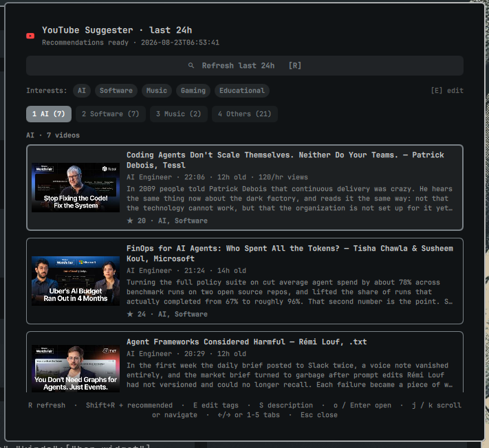

# YouTube Suggester — Omarchy Quattro Plugin

A native Omarchy bar plugin that mimics the useful parts of the YouTube Home page: it shows only unwatched videos, lets you configure the tags used for classification, and displays each video's default YouTube description in a plain-text popup.

On first install `AI` and `Software` are pre-configured as tags — change them with `E` in the panel.



## Features

- **Unwatched Home-style feed** — `R` shows fresh subscription videos from the last 24 hours; `Shift+R` adds 20 personalized Recommended videos (any age), while browser/account history and plugin-opened videos stay filtered out.
- **Configurable tags + `Others`** — edit up to five tags with `E`. Every unwatched video is scored (`title 3×` > `tags 4×` > `description 1×`, single incidental hits ignored). **All** matches per tag are sorted by `age → views/hour → views`; `Others` contains everything unmatched.
- **Title + description in list** — title, description snippet (`320` chars), thumbnail, `duration` · `age` · `views/hour`, channel. Full `meta_description` available in popup.
- **Default description popup `S`** — shows the video's full YouTube description as plain text; `j/k` scrolls it, and `S`/`Enter`/`Esc` closes it.
- **Open** — `o`/`Enter` → `omarchy-launch-webapp https://www.youtube.com/watch?v=ID` (same as `Super+Shift+Y` → `uwsm-app -- <browser> --app=URL`), keeps video visible until next `R` (added to `seen.json`, hidden on next refresh via `watched = history|seen`).
- **Auto-refresh on tag edit** — `E` → `Enter` → `config set` → `loadStatus` → `refresh()` if idle.
- **No per-tab limit, no `no-tag` fallback** — empty tab stays empty (check `Others`).

## Flow

1. `E` edit tags → auto `R`.
2. `R` (or `Shift+R` for +Recommended) → `history → feed → metadata` (`done/total` + `candidates_seen`).
3. Browse tabs `←/→` / `1-5`, navigate `j/k`, open `o`.
4. `S` to read the selected video's description.

## Keybinds

| Key | Action |
|---|---|
| `R` | Refresh last 24h subs |
| `Shift+R` | Refresh subs 24h + 20 Recommended |
| `E` | Edit tags (up to 5, `Enter` saves) |
| `S` | Show the selected video's description (`j/k` scroll) |
| `o` / `Enter` | Open via webapp |
| `j` / `k` , `←` / `→` , `1-5` | Navigate list / tabs |
| `Esc` | Close popup → close panel |
| Middle-click bar icon | Refresh |

## Manual installation

> **Manual install is required** — `omarchy plugin add` only clones the repo and does **not** install system dependencies. Install them first:

**Required:**
- `yt-dlp` — `pacman -S yt-dlp` (or `pipx install yt-dlp`)
- Chromium cookie decrypt (for `browser: chromium`): `pacman -S python-secretstorage python-pycryptodomex` or `pip install --user secretstorage pycryptodomex` (`--break-system-packages` on Arch if needed)

Browser must be logged into YouTube matching `browser` setting (`chromium` default).

## Security

**Plugin privilege:** This plugin runs unsandboxed with your user privileges (same as the Omarchy shell process). Review [`bin/omarchy-youtube-suggester`](bin/omarchy-youtube-suggester) before enabling.

**Browser credentials:** Chrome, Chromium, Brave, and Edge cookies decrypted by the plugin are held in bounded process memory and passed to each `yt-dlp` process through an anonymous Linux `memfd`; they are never written to a named cache file. Browser databases and sidecars are opened without following symlinks, required to be user-owned regular files, backed up with byte limits into private runtime storage, and queried with row, value, profile, and time limits. Other supported browsers use `yt-dlp`'s native browser-cookie support.

**YouTube content is untrusted:** Video titles and descriptions come from YouTube. QML rendering sets `textFormat: Text.PlainText` (and `TextEdit.PlainText` for the description popup) on **every** `Text`/`TextEdit` element, so remote HTML like `` is never interpreted and no remote resources are fetched via `AutoText`.

See `tests/test_browser_security.py`, `tests/test_no_transcription.py`, and `tests/test_qml_safety.py` for regression coverage of browser isolation, the metadata-only pipeline, and plain-text rendering.

## Development & Tests

```bash
# Validate manifest + QML (same checks as the marketplace)
omarchy plugin validate .
qmllint -I /usr/share/omarchy/shell BarWidget.qml Service.qml

# Python tests (metadata-only pipeline and QML safety)
pytest -v
# or
python -m pytest tests -v
```

```bash
PLUGIN_ID="io.github.kkosu.youtube-suggester"
mkdir -p "$HOME/.config/omarchy/plugins/$PLUGIN_ID/bin"
cp manifest.json Service.qml BarWidget.qml Model.js README.md LICENSE \
  "$HOME/.config/omarchy/plugins/$PLUGIN_ID/"
cp bin/omarchy-youtube-suggester "$HOME/.config/omarchy/plugins/$PLUGIN_ID/bin/"
chmod +x "$HOME/.config/omarchy/plugins/$PLUGIN_ID/bin/omarchy-youtube-suggester"

omarchy plugin validate "$HOME/.config/omarchy/plugins/$PLUGIN_ID"
omarchy-shell shell rescanPlugins
omarchy plugin enable "$PLUGIN_ID"
omarchy bar put "$PLUGIN_ID" --section right
```
